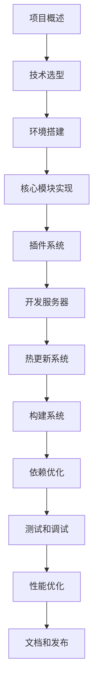

# 项目概述与目标

## 🎯 为什么要构建 Mini Vite？

### 现代前端开发的痛点

在现代前端开发中，开发者面临着诸多挑战：

1. **开发服务器启动缓慢** 📌
   - 传统构建工具需要打包整个应用才能启动
   - 项目越大，启动时间越长
   - 影响开发效率和体验

2. **热更新速度慢** 🔄
   - 修改代码后需要重新打包相关模块
   - 大型项目的热更新可能需要几秒甚至更长时间
   - 打断开发思路，降低生产力

3. **构建配置复杂** ⚙️
   - Webpack 等工具配置繁琐
   - 需要深入了解各种 loader 和 plugin
   - 维护成本高，学习曲线陡峭

4. **依赖处理效率低** 📦
   - CommonJS 模块需要转换为浏览器可用格式
   - 第三方依赖重复处理
   - 缺乏智能缓存机制

### Vite 的革命性解决方案

Vite 通过以下创新解决了这些问题：

- **ES 模块原生支持**: 利用浏览器原生 ES 模块，无需打包即可运行
- **依赖预构建**: 使用 esbuild 预构建依赖，显著提升速度
- **按需编译**: 只编译当前访问的模块
- **智能热更新**: 精确更新变更模块，保持应用状态

## 🔍 Mini Vite 的核心目标

### 学习目标 📚

通过构建 Mini Vite，我们将深入理解：

1. **现代构建工具的核心原理**
   - ES 模块系统的工作机制
   - 模块解析和转换流程
   - 依赖图的构建和维护

2. **高性能开发服务器的实现**
   - 中间件架构设计
   - 文件监听和变更检测
   - WebSocket 通信机制

3. **插件系统的设计模式**
   - 钩子函数的设计
   - 插件间的通信和协作
   - 可扩展架构的实现

4. **构建优化的最佳实践**
   - 代码分割策略
   - 资源处理和优化
   - 缓存机制设计

### 技术目标 🛠️

Mini Vite 将实现以下核心功能：

1. **快速开发服务器**
   - 秒级启动时间
   - 实时热更新 (HMR)
   - 静态资源服务

2. **高效构建系统**
   - 基于 Rollup 的生产构建
   - 代码压缩和优化
   - Source Map 支持

3. **灵活插件架构**
   - 统一的插件接口
   - 丰富的生命周期钩子
   - 内置常用插件

4. **智能依赖处理**
   - 依赖预构建
   - 模块缓存
   - 增量更新

## 🚀 项目特性概览

### 核心特性

| 特性 | 描述 | 实现方式 |
|------|------|----------|
| **快速启动** | 开发服务器秒级启动 | ES 模块 + 按需编译 |
| **热更新** | 毫秒级的模块热替换 | WebSocket + 模块图 |
| **插件系统** | 灵活的功能扩展 | 钩子函数 + 中间件 |
| **依赖优化** | 智能的依赖预构建 | esbuild + 缓存 |
| **TypeScript** | 原生 TS/JSX 支持 | esbuild 转换 |
| **CSS 处理** | CSS 模块和注入 | PostCSS + 插件 |
| **静态资源** | 自动资源处理 | 文件哈希 + 优化 |
| **生产构建** | 高效的打包优化 | Rollup + 压缩 |

### 技术亮点

1. **零配置启动** 🎯
   ```bash
   # 一行命令启动开发服务器
   mini-vite dev
   ```

2. **智能模块解析** 🧠
   ```javascript
   // 自动处理各种导入方式
   import { createApp } from 'vue'        // npm 包
   import App from './App.vue'            // 相对路径
   import logo from '@/assets/logo.png'   // 别名
   ```

3. **高效热更新** ⚡
   ```javascript
   // 精确更新，保持应用状态
   if (import.meta.hot) {
     import.meta.hot.accept('./component.vue', (newModule) => {
       // 只更新变更的组件
     })
   }
   ```

4. **灵活插件系统** 🔌
   ```javascript
   // 简单的插件定义
   function myPlugin() {
     return {
       name: 'my-plugin',
       transform(code, id) {
         // 自定义转换逻辑
       }
     }
   }
   ```

## 💡 学习价值

### 对前端开发者的价值

1. **深入理解现代构建工具**
   - 掌握 ES 模块系统
   - 理解构建优化原理
   - 学会性能调优技巧

2. **提升架构设计能力**
   - 学习插件系统设计
   - 理解中间件模式
   - 掌握可扩展架构

3. **增强问题解决能力**
   - 学会分析性能瓶颈
   - 掌握调试技巧
   - 培养系统思维

### 对技术团队的价值

1. **技术选型参考**
   - 了解不同工具的优劣
   - 掌握技术决策方法
   - 建立评估标准

2. **团队技能提升**
   - 统一技术认知
   - 提高开发效率
   - 增强创新能力

3. **项目实践指导**
   - 提供最佳实践
   - 避免常见陷阱
   - 优化开发流程

## 🎓 预期学习成果

完成本项目学习后，您将能够：

### 技能掌握 ✅

- [ ] 理解现代前端构建工具的核心原理
- [ ] 掌握 ES 模块系统和模块解析机制
- [ ] 学会设计和实现插件系统
- [ ] 熟练使用 Node.js 构建开发工具
- [ ] 掌握 WebSocket 实时通信技术
- [ ] 理解文件监听和热更新机制
- [ ] 学会性能优化和缓存策略
- [ ] 掌握构建工具的测试方法

### 项目产出 📦

- [ ] 一个完整的类 Vite 构建工具
- [ ] 详细的技术文档和注释
- [ ] 完善的测试用例
- [ ] 可扩展的插件示例
- [ ] 性能优化的最佳实践

### 能力提升 🚀

- [ ] 系统架构设计能力
- [ ] 复杂问题分解能力
- [ ] 代码质量控制能力
- [ ] 技术文档编写能力
- [ ] 开源项目维护能力

## 🗺️ 学习路线图



## 🎯 下一步

现在您已经了解了 Mini Vite 项目的整体目标和价值，接下来我们将深入学习：

1. **[技术选型与架构决策](./02-tech-stack.md)** - 了解为什么选择这些技术
2. **[分步骤实现过程](./03-implementation-steps.md)** - 开始动手实践
3. **[关键技术点深入解析](./04-technical-deep-dive.md)** - 掌握核心原理

让我们开始这段精彩的技术探索之旅！🚀
