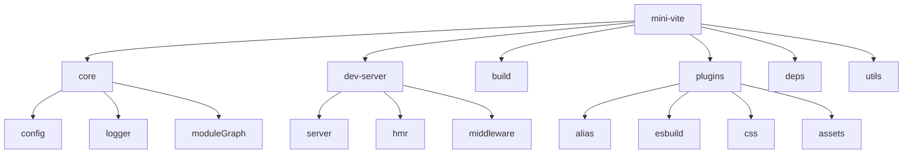
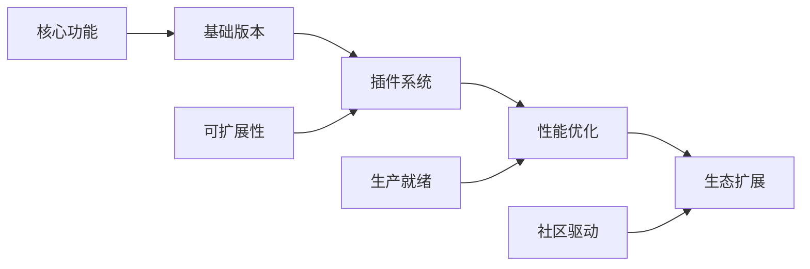

# 技术选型与架构决策

## 🛠️ 核心技术栈

### 运行时环境

**Node.js + TypeScript**
- **选择理由**: 
  - Node.js 提供了丰富的文件系统和网络 API
  - TypeScript 提供类型安全和更好的开发体验
  - 与前端技术栈保持一致，降低学习成本

- **版本要求**: Node.js 16+ (支持 ES 模块)
- **配置**: 使用 ES 模块 (`"type": "module"`)

### 开发服务器

**Connect + 自定义中间件**
```javascript
import connect from 'connect'

const app = connect()
app.use('/api', apiMiddleware)
app.use(staticMiddleware)
```

- **选择理由**:
  - 轻量级，专注于中间件功能
  - 灵活的中间件架构
  - 易于扩展和定制
  - 性能优秀，内存占用小

- **替代方案对比**:
  - Express: 功能过于丰富，不需要路由等功能
  - Koa: 基于 async/await，但 Connect 更简单直接
  - 原生 http: 需要自己实现中间件系统

### 代码转换

**esbuild**
```javascript
import { transform } from 'esbuild'

const result = await transform(code, {
  loader: 'tsx',
  target: 'es2020',
  format: 'esm'
})
```

- **选择理由**:
  - 极快的转换速度 (Go 语言实现)
  - 内置 TypeScript/JSX 支持
  - 零配置，开箱即用
  - 支持 ES 模块输出

- **性能对比**:
  - esbuild: ~10ms (TypeScript → JavaScript)
  - Babel: ~100ms (相同转换)
  - TypeScript Compiler: ~200ms

### 生产构建

**Rollup**
```javascript
import { rollup } from 'rollup'

const bundle = await rollup({
  input: 'src/main.js',
  plugins: [/* ... */]
})
```

- **选择理由**:
  - 专为 ES 模块设计
  - 优秀的 Tree Shaking
  - 丰富的插件生态
  - 输出代码质量高

- **与其他工具对比**:
  - Webpack: 更适合复杂应用，配置复杂
  - Parcel: 零配置但定制性差
  - esbuild: 速度快但功能相对简单

### 文件监听

**chokidar**
```javascript
import chokidar from 'chokidar'

const watcher = chokidar.watch('src/**/*')
watcher.on('change', handleFileChange)
```

- **选择理由**:
  - 跨平台兼容性好
  - 高性能，低 CPU 占用
  - 丰富的事件类型
  - 稳定可靠，广泛使用

### WebSocket 通信

**ws**
```javascript
import { WebSocketServer } from 'ws'

const wss = new WebSocketServer({ port: 3001 })
wss.on('connection', handleConnection)
```

- **选择理由**:
  - 轻量级，专注于 WebSocket 功能
  - 性能优秀
  - API 简单易用
  - 支持自定义协议

### 静态文件服务

**sirv**
```javascript
import sirv from 'sirv'

const serve = sirv('public', {
  dev: true,
  etag: true
})
```

- **选择理由**:
  - 高性能静态文件服务
  - 支持 HTTP 缓存
  - 轻量级实现
  - 开发友好的选项

## 🏗️ 架构设计原则

### 1. 模块化设计

**单一职责原则**
```
src/
├── core/           # 核心功能 (配置、日志、模块图)
├── dev-server/     # 开发服务器
├── build/          # 构建系统
├── plugins/        # 插件系统
├── deps/           # 依赖优化
└── utils/          # 工具函数
```

每个模块都有明确的职责边界，便于维护和测试。

### 2. 插件驱动架构

**钩子函数设计**
```typescript
interface Plugin {
  name: string
  configResolved?: (config: ResolvedConfig) => void
  buildStart?: () => void
  resolveId?: (id: string) => string | null
  load?: (id: string) => string | null
  transform?: (code: string, id: string) => TransformResult
}
```

- 统一的插件接口
- 丰富的生命周期钩子
- 异步插件支持
- 插件间通信机制

### 3. 中间件模式

**请求处理流水线**
```javascript
// 中间件注册顺序
app.use(corsMiddleware)        // CORS 处理
app.use(hmrMiddleware)         // HMR 通信
app.use(transformMiddleware)   // 模块转换
app.use(staticMiddleware)      // 静态文件
```

每个中间件处理特定类型的请求，形成处理链。

### 4. 依赖注入

**配置和服务注入**
```typescript
class DevServer {
  constructor(
    private config: ResolvedConfig,
    private moduleGraph: ModuleGraph,
    private pluginContainer: PluginContainer
  ) {}
}
```

通过依赖注入提高模块间的解耦和可测试性。

## ⚖️ 技术选型对比

### 开发服务器对比

| 方案 | 优点 | 缺点 | 适用场景 |
|------|------|------|----------|
| **Connect** | 轻量、灵活、中间件丰富 | 功能相对简单 | ✅ 构建工具 |
| Express | 功能完整、生态丰富 | 体积大、功能冗余 | Web 应用 |
| Fastify | 性能极佳、类型友好 | 学习成本高 | 高性能 API |
| Koa | 现代语法、洋葱模型 | 生态相对较小 | 现代 Web 应用 |

### 代码转换对比

| 工具 | 速度 | 功能 | 生态 | 配置复杂度 |
|------|------|------|------|------------|
| **esbuild** | ⭐⭐⭐⭐⭐ | ⭐⭐⭐ | ⭐⭐⭐ | ⭐ |
| Babel | ⭐⭐ | ⭐⭐⭐⭐⭐ | ⭐⭐⭐⭐⭐ | ⭐⭐⭐⭐ |
| SWC | ⭐⭐⭐⭐ | ⭐⭐⭐⭐ | ⭐⭐⭐ | ⭐⭐ |
| TypeScript | ⭐⭐ | ⭐⭐⭐⭐ | ⭐⭐⭐⭐ | ⭐⭐⭐ |

### 构建工具对比

| 工具 | Tree Shaking | 代码分割 | 插件生态 | 学习成本 |
|------|--------------|----------|----------|----------|
| **Rollup** | ⭐⭐⭐⭐⭐ | ⭐⭐⭐⭐ | ⭐⭐⭐⭐ | ⭐⭐⭐ |
| Webpack | ⭐⭐⭐⭐ | ⭐⭐⭐⭐⭐ | ⭐⭐⭐⭐⭐ | ⭐⭐⭐⭐⭐ |
| Parcel | ⭐⭐⭐ | ⭐⭐⭐ | ⭐⭐ | ⭐ |
| esbuild | ⭐⭐⭐ | ⭐⭐ | ⭐⭐ | ⭐ |

## 📐 模块化设计思路

### 核心模块划分



### 依赖关系设计

**分层架构**
```
┌─────────────────┐
│   CLI Layer     │  命令行接口
├─────────────────┤
│  Service Layer  │  开发服务器、构建服务
├─────────────────┤
│  Plugin Layer   │  插件系统
├─────────────────┤
│   Core Layer    │  配置、日志、模块图
├─────────────────┤
│  Utils Layer    │  工具函数
└─────────────────┘
```

**依赖方向**: 上层依赖下层，下层不依赖上层

### 接口设计原则

**1. 最小接口原则**
```typescript
// 只暴露必要的方法
interface ModuleGraph {
  getModuleByUrl(url: string): ModuleNode | undefined
  onFileChange(file: string): void
  invalidateModule(mod: ModuleNode): void
}
```

**2. 依赖倒置原则**
```typescript
// 依赖抽象而非具体实现
interface Logger {
  info(msg: string): void
  warn(msg: string): void
  error(msg: string): void
}

class DevServer {
  constructor(private logger: Logger) {}
}
```

**3. 开闭原则**
```typescript
// 对扩展开放，对修改关闭
interface Plugin {
  name: string
  // 可扩展的钩子函数
  [hookName: string]: any
}
```

## 🎯 架构优势

### 1. 高性能
- **esbuild**: 极快的代码转换
- **ES 模块**: 浏览器原生支持，无需打包
- **按需编译**: 只处理访问的模块
- **智能缓存**: 避免重复处理

### 2. 高可扩展性
- **插件系统**: 功能可插拔
- **中间件架构**: 请求处理可定制
- **配置系统**: 灵活的配置选项
- **钩子函数**: 丰富的扩展点

### 3. 高可维护性
- **模块化设计**: 职责清晰
- **类型安全**: TypeScript 支持
- **单元测试**: 完善的测试覆盖
- **文档完善**: 详细的 API 文档

### 4. 开发友好
- **零配置**: 开箱即用
- **热更新**: 快速反馈
- **错误提示**: 友好的错误信息
- **调试支持**: Source Map 支持

## 🔄 与 Vite 的对比

### 相似之处
- ES 模块优先的开发体验
- 依赖预构建优化
- 插件驱动的架构
- 快速的热更新

### 简化之处
- **插件系统**: 更简单的钩子设计
- **配置选项**: 聚焦核心功能
- **文件类型**: 支持基础的 JS/TS/CSS
- **优化策略**: 基础的构建优化

### 技术差异

| 方面 | Vite | Mini Vite |
|------|------|-----------|
| 插件系统 | Rollup 插件兼容 | 自定义简化版本 |
| CSS 处理 | PostCSS + 预处理器 | 基础 CSS 处理 |
| 框架支持 | Vue/React/Svelte | 通用 JS/TS |
| 构建优化 | 高度优化 | 基础优化 |

## 🎓 设计思考

### 为什么选择这样的架构？

1. **学习友好**: 简化复杂度，突出核心概念
2. **实用性强**: 涵盖现代构建工具的关键特性
3. **扩展性好**: 为后续功能扩展留下空间
4. **性能优秀**: 选择高性能的底层工具

### 架构演进思路



## 🚀 下一步

现在您已经了解了 Mini Vite 的技术选型和架构设计，接下来我们将：

1. **[分步骤实现过程](./03-implementation-steps.md)** - 开始动手实现
2. **[关键技术点深入解析](./04-technical-deep-dive.md)** - 深入理解核心原理

让我们开始构建这个强大的工具！🛠️
