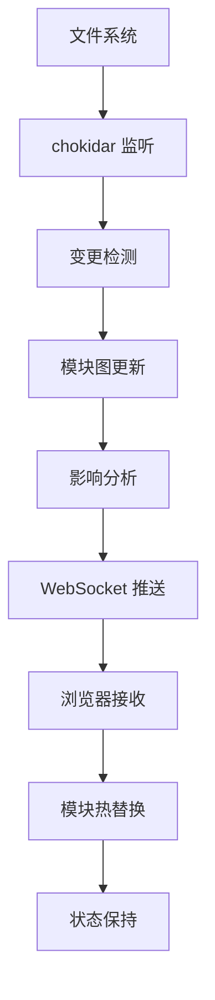

# 关键技术点深入解析

## 🔄 ES 模块处理机制

### ES 模块系统原理

**传统构建 vs ES 模块**
```javascript
// 传统方式：需要打包所有模块
// main.js + utils.js + components/* → bundle.js

// ES 模块方式：浏览器按需加载
import { createApp } from 'vue'        // 直接从 node_modules 加载
import App from './App.vue'            // 按需转换和加载
import './style.css'                   // 动态注入样式
```

### 模块解析流程

**1. URL 重写机制**
```typescript
// 浏览器请求：import { createApp } from 'vue'
// 服务器重写为：import { createApp } from '/@modules/vue'

function rewriteImports(code: string): string {
  return code.replace(
    /import\s+.*?\s+from\s+['"]([^'"]+)['"]/g,
    (match, id) => {
      if (id.startsWith('.') || id.startsWith('/')) {
        return match // 相对路径不处理
      }
      return match.replace(id, `/@modules/${id}`)
    }
  )
}
```

**2. 模块 ID 解析**
```typescript
async function resolveId(id: string, importer?: string): Promise<string | null> {
  // 1. 处理别名
  if (id.startsWith('@/')) {
    return resolve(config.root, 'src', id.slice(2))
  }
  
  // 2. 处理相对路径
  if (id.startsWith('.')) {
    return resolve(dirname(importer!), id)
  }
  
  // 3. 处理 node_modules
  if (!id.startsWith('/')) {
    return resolve(config.root, 'node_modules', id, 'index.js')
  }
  
  return id
}
```

**3. 模块加载和转换**
```typescript
async function transformRequest(url: string): Promise<TransformResult> {
  // 1. 解析模块 ID
  const id = await pluginContainer.resolveId(url)
  
  // 2. 检查缓存
  const cached = moduleGraph.getModuleById(id)
  if (cached?.transformResult) {
    return cached.transformResult
  }
  
  // 3. 加载源码
  const code = await pluginContainer.load(id) || await fs.readFile(id, 'utf-8')
  
  // 4. 转换代码
  const result = await pluginContainer.transform(code, id)
  
  // 5. 缓存结果
  const mod = moduleGraph.ensureEntryFromUrl(url)
  mod.transformResult = result
  
  return result
}
```

### 依赖预构建详解

**为什么需要预构建？**
```javascript
// 问题1：CommonJS 模块无法直接在浏览器使用
const express = require('express')  // ❌ 浏览器不支持

// 问题2：深层依赖导致大量网络请求
import 'lodash'  // 可能触发几十个子模块请求

// 解决方案：预构建为单个 ESM 文件
import express from '/@modules/express'  // ✅ 单个文件，ESM 格式
```

**预构建实现**
```typescript
export class DepsOptimizer {
  async run() {
    // 1. 扫描依赖
    const deps = await this.scanDependencies()
    
    // 2. 检查缓存
    const needsRebuild = await this.checkCache(deps)
    
    if (needsRebuild) {
      // 3. 使用 esbuild 预构建
      await this.buildDependencies(deps)
    }
  }
  
  private async scanDependencies(): Promise<string[]> {
    const deps = new Set<string>()
    
    // 扫描入口文件
    for (const entry of this.config.optimizeDeps.entries) {
      const code = await fs.readFile(entry, 'utf-8')
      const imports = parse(code)[0] // 使用 es-module-lexer
      
      imports.forEach(imp => {
        if (!imp.n?.startsWith('.') && !imp.n?.startsWith('/')) {
          deps.add(imp.n!)
        }
      })
    }
    
    return Array.from(deps)
  }
  
  private async buildDependencies(deps: string[]) {
    await esbuild.build({
      entryPoints: deps.map(dep => ({
        out: dep,
        in: require.resolve(dep)
      })),
      bundle: true,
      format: 'esm',
      outdir: this.getCacheDir(),
      splitting: true
    })
  }
}
```

## 🔥 HMR 实现原理

### HMR 系统架构



### 服务端 HMR 实现

**1. 文件监听**
```typescript
function setupFileWatcher(server: DevServer) {
  const watcher = chokidar.watch(server.config.root, {
    ignored: ['**/node_modules/**', '**/.git/**'],
    ignoreInitial: true,
    awaitWriteFinish: {
      stabilityThreshold: 100,
      pollInterval: 10
    }
  })
  
  watcher.on('change', async (file) => {
    await handleFileChange(file, server)
  })
  
  return watcher
}
```

**2. 变更处理**
```typescript
async function handleFileChange(file: string, server: DevServer) {
  const { moduleGraph, ws, config } = server
  
  // 1. 更新模块图
  moduleGraph.onFileChange(file)
  
  // 2. 分析影响范围
  const affectedModules = getAffectedModules(file, moduleGraph)
  
  // 3. 生成更新信息
  const updates = await Promise.all(
    affectedModules.map(async mod => {
      if (mod.id.endsWith('.css')) {
        return {
          type: 'css-update',
          path: mod.id,
          timestamp: Date.now()
        }
      } else {
        return {
          type: 'js-update',
          path: mod.id,
          timestamp: Date.now()
        }
      }
    })
  )
  
  // 4. 推送更新
  ws.clients.forEach(client => {
    client.send(JSON.stringify({
      type: 'update',
      updates
    }))
  })
}
```

**3. 影响分析算法**
```typescript
function getAffectedModules(file: string, moduleGraph: ModuleGraph): ModuleNode[] {
  const affected = new Set<ModuleNode>()
  const visited = new Set<ModuleNode>()
  
  function traverse(mod: ModuleNode) {
    if (visited.has(mod)) return
    visited.add(mod)
    
    // 如果模块接受自身更新，停止传播
    if (mod.isSelfAccepting) {
      affected.add(mod)
      return
    }
    
    // 检查是否有接受此模块更新的父模块
    let hasAcceptingParent = false
    for (const importer of mod.importers) {
      if (importer.acceptedHmrDeps.has(mod)) {
        affected.add(importer)
        hasAcceptingParent = true
      }
    }
    
    // 如果没有接受更新的父模块，继续向上传播
    if (!hasAcceptingParent) {
      mod.importers.forEach(traverse)
    }
  }
  
  const changedMod = moduleGraph.getModulesByFile(file)
  changedMod?.forEach(traverse)
  
  return Array.from(affected)
}
```

### 客户端 HMR 实现

**1. HMR 客户端代码**
```typescript
// 注入到每个模块的 HMR 客户端代码
const hmrClient = `
class HMRClient {
  constructor() {
    this.ws = new WebSocket('ws://localhost:3001')
    this.setupEventHandlers()
  }
  
  setupEventHandlers() {
    this.ws.onmessage = async (event) => {
      const data = JSON.parse(event.data)
      
      switch (data.type) {
        case 'update':
          await this.handleUpdate(data.updates)
          break
        case 'full-reload':
          location.reload()
          break
      }
    }
  }
  
  async handleUpdate(updates) {
    for (const update of updates) {
      if (update.type === 'js-update') {
        await this.updateJSModule(update)
      } else if (update.type === 'css-update') {
        this.updateCSSModule(update)
      }
    }
  }
  
  async updateJSModule(update) {
    const module = this.moduleCache.get(update.path)
    if (module?.hot?.accept) {
      try {
        // 动态导入新模块
        const newModule = await import(update.path + '?t=' + update.timestamp)
        
        // 执行热更新回调
        module.hot.accept(newModule)
      } catch (error) {
        console.error('HMR update failed:', error)
        location.reload()
      }
    }
  }
  
  updateCSSModule(update) {
    const links = document.querySelectorAll(\`link[href*="\${update.path}"]\`)
    links.forEach(link => {
      const newLink = link.cloneNode()
      newLink.href = update.path + '?t=' + update.timestamp
      link.parentNode.insertBefore(newLink, link.nextSibling)
      link.remove()
    })
  }
}

// 全局 HMR API
if (import.meta.hot) {
  window.__HMR_CLIENT__ = new HMRClient()
}
`
```

**2. HMR API 设计**
```typescript
// 为每个模块注入的 HMR API
interface ImportMeta {
  hot?: {
    accept(): void
    accept(dep: string, callback: (newModule: any) => void): void
    accept(deps: string[], callback: (newModules: any[]) => void): void
    dispose(callback: () => void): void
    decline(): void
    invalidate(): void
    data: any
  }
}

// 使用示例
if (import.meta.hot) {
  // 接受自身更新
  import.meta.hot.accept()
  
  // 接受依赖更新
  import.meta.hot.accept('./component.vue', (newComponent) => {
    // 更新组件
    updateComponent(newComponent.default)
  })
  
  // 清理副作用
  import.meta.hot.dispose(() => {
    clearInterval(timer)
  })
}
```

## 🔌 插件系统设计

### 插件架构原理

**Rollup 插件兼容性**
```typescript
// Mini Vite 插件接口（简化版 Rollup 插件）
interface Plugin {
  name: string
  
  // 构建钩子
  buildStart?: (opts: any) => void | Promise<void>
  resolveId?: (id: string, importer?: string) => string | null | Promise<string | null>
  load?: (id: string) => string | null | Promise<string | null>
  transform?: (code: string, id: string) => TransformResult | null | Promise<TransformResult | null>
  generateBundle?: (opts: any, bundle: any) => void | Promise<void>
  
  // 开发服务器钩子
  configResolved?: (config: ResolvedConfig) => void | Promise<void>
  configureServer?: (server: DevServer) => void | Promise<void>
  handleHotUpdate?: (ctx: HmrContext) => void | Promise<void>
}
```

### 插件容器实现

**1. 插件执行引擎**
```typescript
export class PluginContainer {
  private plugins: Plugin[]
  
  constructor(config: ResolvedConfig, moduleGraph: ModuleGraph) {
    this.plugins = config.plugins
  }
  
  async resolveId(id: string, importer?: string): Promise<string | null> {
    let resolvedId = id
    
    for (const plugin of this.plugins) {
      if (!plugin.resolveId) continue
      
      const result = await plugin.resolveId(resolvedId, importer)
      if (result) {
        resolvedId = result
        break
      }
    }
    
    return resolvedId !== id ? resolvedId : null
  }
  
  async transform(code: string, id: string): Promise<TransformResult> {
    let result = { code, map: null }
    
    for (const plugin of this.plugins) {
      if (!plugin.transform) continue
      
      const transformResult = await plugin.transform(result.code, id)
      if (transformResult) {
        result = {
          code: transformResult.code,
          map: combineSourceMaps(result.map, transformResult.map)
        }
      }
    }
    
    return result
  }
}
```

**2. 内置插件实现**

**esbuild 插件**
```typescript
export function esbuildPlugin(): Plugin {
  return {
    name: 'esbuild',
    async transform(code: string, id: string) {
      if (!/\.(tsx?|jsx?)$/.test(id)) return null
      
      const result = await transform(code, {
        loader: getLoader(id),
        target: 'es2020',
        format: 'esm',
        sourcemap: true,
        jsx: 'automatic'
      })
      
      return {
        code: result.code,
        map: result.map
      }
    }
  }
}
```

**CSS 插件**
```typescript
export function cssPlugin(): Plugin {
  return {
    name: 'css',
    async transform(code: string, id: string) {
      if (!id.endsWith('.css')) return null
      
      // CSS 模块处理
      if (id.includes('.module.css')) {
        const { css, modules } = await processCSSModules(code, id)
        return {
          code: `
const modules = ${JSON.stringify(modules)}
const css = ${JSON.stringify(css)}
updateStyle(${JSON.stringify(id)}, css)
export default modules
`,
          map: null
        }
      }
      
      // 普通 CSS 处理
      return {
        code: `
const css = ${JSON.stringify(code)}
updateStyle(${JSON.stringify(id)}, css)
export default css
`,
        map: null
      }
    }
  }
}
```

**静态资源插件**
```typescript
export function assetPlugin(): Plugin {
  return {
    name: 'asset',
    load(id: string) {
      if (isStaticAsset(id)) {
        // 生成资源 URL
        const url = this.emitFile({
          type: 'asset',
          name: basename(id),
          source: readFileSync(id)
        })
        
        return `export default ${JSON.stringify(url)}`
      }
      return null
    }
  }
}
```

## ⚡ 构建优化策略

### 开发时优化

**1. 按需编译**
```typescript
// 只编译当前访问的模块
async function transformMiddleware(req: any, res: any, next: any) {
  const url = req.url
  
  if (shouldTransform(url)) {
    try {
      // 检查缓存
      const cached = getFromCache(url)
      if (cached && !isStale(cached)) {
        return sendCached(res, cached)
      }
      
      // 按需转换
      const result = await transformRequest(url)
      setCache(url, result)
      sendTransformed(res, result)
    } catch (error) {
      next(error)
    }
  } else {
    next()
  }
}
```

**2. 智能缓存**
```typescript
class TransformCache {
  private cache = new Map<string, CacheEntry>()
  
  get(id: string): TransformResult | null {
    const entry = this.cache.get(id)
    if (!entry) return null
    
    // 检查文件是否变更
    const stat = fs.statSync(id)
    if (stat.mtime.getTime() > entry.timestamp) {
      this.cache.delete(id)
      return null
    }
    
    return entry.result
  }
  
  set(id: string, result: TransformResult) {
    this.cache.set(id, {
      result,
      timestamp: Date.now()
    })
  }
}
```

### 生产构建优化

**1. 代码分割**
```typescript
// Rollup 配置
export default {
  input: 'src/main.js',
  output: {
    dir: 'dist',
    format: 'es',
    manualChunks: {
      // 分离第三方库
      vendor: ['vue', 'vue-router'],
      // 分离工具函数
      utils: ['lodash', 'axios']
    }
  },
  plugins: [
    // 动态导入分割
    {
      name: 'dynamic-import-split',
      generateBundle(opts, bundle) {
        // 自动分割动态导入的模块
      }
    }
  ]
}
```

**2. Tree Shaking 优化**
```typescript
// 确保模块标记为 side-effect free
{
  "name": "my-package",
  "sideEffects": false,  // 或者 ["*.css", "*.scss"]
  "module": "dist/index.esm.js"
}

// 使用 ES 模块导出
export { createApp } from './app'
export { router } from './router'
// 避免 export * from './index'
```

**3. 资源优化**
```typescript
function optimizeAssets(): Plugin {
  return {
    name: 'optimize-assets',
    generateBundle(opts, bundle) {
      Object.keys(bundle).forEach(fileName => {
        const chunk = bundle[fileName]
        
        if (chunk.type === 'asset') {
          // 图片压缩
          if (/\.(png|jpg|jpeg)$/.test(fileName)) {
            chunk.source = compressImage(chunk.source)
          }
          
          // 添加文件哈希
          const hash = generateHash(chunk.source)
          const newFileName = fileName.replace(/(\.[^.]+)$/, `.${hash}$1`)
          bundle[newFileName] = chunk
          delete bundle[fileName]
        }
      })
    }
  }
}
```

## 🎯 性能监控和调试

### 性能指标收集

```typescript
class PerformanceMonitor {
  private metrics = new Map<string, number[]>()
  
  time<T>(label: string, fn: () => Promise<T>): Promise<T> {
    const start = performance.now()
    return fn().finally(() => {
      const duration = performance.now() - start
      this.record(label, duration)
    })
  }
  
  record(label: string, value: number) {
    if (!this.metrics.has(label)) {
      this.metrics.set(label, [])
    }
    this.metrics.get(label)!.push(value)
  }
  
  getStats(label: string) {
    const values = this.metrics.get(label) || []
    return {
      count: values.length,
      avg: values.reduce((a, b) => a + b, 0) / values.length,
      min: Math.min(...values),
      max: Math.max(...values)
    }
  }
}
```

### 调试工具

```typescript
// 开发时的调试中间件
function debugMiddleware(): Plugin {
  return {
    name: 'debug',
    configureServer(server) {
      server.middlewares.use('/__debug', (req, res) => {
        const stats = {
          moduleGraph: server.moduleGraph.getStats(),
          cache: getCacheStats(),
          performance: getPerformanceStats()
        }
        
        res.setHeader('Content-Type', 'application/json')
        res.end(JSON.stringify(stats, null, 2))
      })
    }
  }
}
```

## 🚀 下一步

现在您已经深入了解了 Mini Vite 的核心技术原理，接下来可以：

1. **[学习挑战解决方案](./05-challenges-solutions.md)** - 了解实际开发中的问题
2. **[掌握最佳实践](./06-best-practices.md)** - 提升代码质量
3. **[探索扩展方向](./07-future-improvements.md)** - 思考改进空间

继续深入学习，掌握现代构建工具的精髓！🔍
